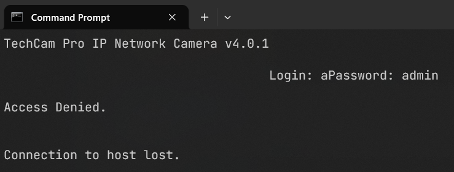
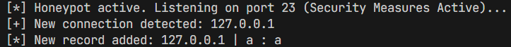
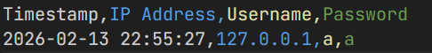

# 🎥 techcam-honeypot 🍯

> A lightweight, pure-Python IoT Honeypot designed to mimic a vulnerable IP security camera and log unauthorized access attempts.


## 📖 About The Project

**techcam-honeypot** is an educational blue-team project. It opens a listener on port `23` and presents a realistic, interactive banner of a fake IP camera (`TechCam Pro IP Network Camera v4.0.1`). 

When automated botnets, malicious scripts, or curious individuals try to log in, it captures their IP addresses and credential attempts, safely storing them in a CSV file for further analysis.

### ✨ Key Features
* **Zero Dependencies:** Built entirely with Python's standard library (`socket`, `threading`, `csv`, `datetime`, `time`, `os`). No external packages required!
* **Realistic Decoy:** Interactive Telnet login sequence that fools automated scanners.
* **Safe Input Handling:** Implements data truncation and timeouts to prevent buffer overflow attacks or hung connections.
* **CSV Logging:** Automatically logs Timestamp, IP Address, Username, and Password attempts into `captured_attackers.csv`.

---

## 🚀 Getting Started

### Prerequisites
All you need is Python 3.x installed on your machine.

### Installation & Usage

**1. Clone the repository:**
```bash
git clone https://github.com/sonerkaracoban/techcam-honeypot.git
cd techcam-honeypot
```

**2. Run the honeypot:**
```bash
python honeypot.py
```
*(You should see: `[*] Honeypot active. Listening on port 23...`)*

**3. Test the honeypot:**
Open another terminal or use another device on the same network to test the decoy:
```bash
telnet localhost 23
```

### 📸 Honeypot in Action

**1. The Bait (Attacker's View - Telnet Login)**



**2. The Trap (Server's View - Catching the IP)**



**3. The Catch (Logged Credentials in CSV)**



---

## ⚠️ Disclaimer
This project is created strictly for **educational purposes and ethical research**. Do not deploy this in production environments without proper isolation. The author is not responsible for any misuse or damage caused by this software.

## 🤝 Contributing
Contributions, issues, and feature requests are welcome! Feel free to check the issues page.
